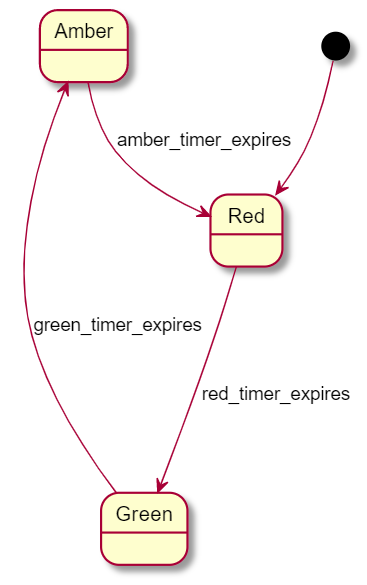

## Traffic light states

### Description

A traffic light simulation, using Finite State Machine. 
There are 3 states:
- Red
- Amber
- Green

and 3 events:
- red_timer_expires
- amber_timer_expires
- green timer expires

